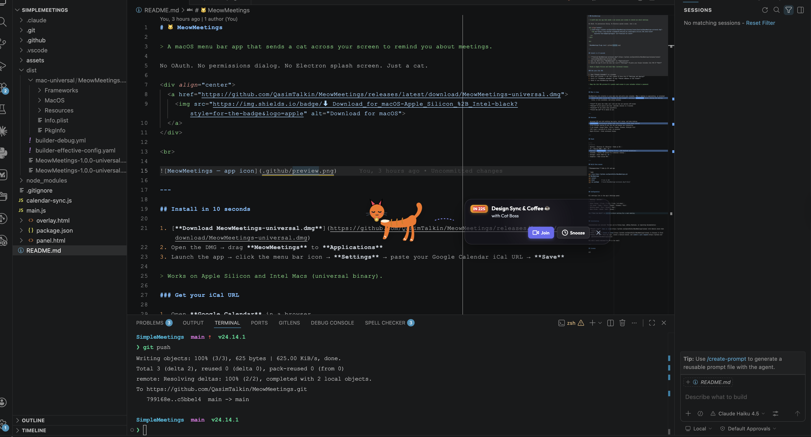

# 🐱 MeowMeetings

> A macOS menu bar app that sends a cat across your screen to remind you about meetings.

No OAuth. No permissions dialog. No Electron splash screen. Just a cat.

<div align="center">
  <a href="https://github.com/QasimTalkin/MeowMeetings/releases/latest/download/MeowMeetings-universal.dmg">
    
  </a>
</div>

<br>



---

## Install in 10 seconds

1. [**Download MeowMeetings-universal.dmg**](https://github.com/QasimTalkin/MeowMeetings/releases/latest/download/MeowMeetings-universal.dmg)
2. Open the DMG → drag **MeowMeetings** to **Applications**
3. Launch the app → click the menu bar icon → **Settings** → paste your Google Calendar iCal URL → **Save**

> Works on Apple Silicon and Intel Macs (universal binary).

### Get your iCal URL

1. Open **Google Calendar** in a browser
2. Hover your calendar in the left sidebar → three dots → **Settings and sharing**
3. Scroll to **Integrate calendar** → copy **Secret address in iCal format**
4. Paste it into MeowMeetings Settings

> Keep the iCal URL private — it grants read access to your calendar without a password.

---

## What it does

MeowMeetings sits silently in your menu bar and polls your calendar. When a meeting is approaching, an animated vector cat walks across the **center of your screen**, pulling a glassmorphic banner showing the meeting title, a live countdown, and action buttons.

- **Join** — opens the video call link and the cat sprints off-screen
- **Snooze** — cat panics and runs; reminder returns in 2 minutes
- **Dismiss** — cat walks away gracefully
- **Click the cat** — it meows at you

---

## Features

- Animated SVG cat with walking leg cycle, tail swing, and body bobbing
- Glassmorphic notification banner with live countdown (ticks every second)
- Click-through overlay — only the cat and banner are interactive
- 5 cat breeds: Orange Tabby, Calico, Tuxedo, Siamese, Midnight Void
- 100% local & private — no cloud, no accounts
- Apple Silicon + Intel universal binary

---

## Stack

| | |
|---|---|
| Runtime | Electron 31 (Chromium + Node.js 22) |
| UI | Vanilla HTML / CSS / JS |
| Styling | Glassmorphism, `backdrop-filter`, CSS keyframe animations |
| Calendar | Custom ICS parser — no external library |
| Storage | Plain JSON via `fs` |
| Graphics | Pure inline SVG |

---

## Build from source

**Prerequisites:** Node.js 18+ and npm.

```bash
git clone https://github.com/QasimTalkin/MeowMeetings.git
cd MeowMeetings
npm install
npm start          # run in dev
npm run package    # build MeowMeetings-universal.dmg → dist/
```

---

## Configuration

All settings live in the app's Settings panel:

| Setting | Options |
|---|---|
| Alert timing | 10 min / 5 min / 2 min / at start |
| Cat breed | Tabby / Calico / Tuxedo / Siamese / Void |
| Walking speed | Slow / Normal / Fast |
| Meow volume | Muted / Soft / Normal |

Hit **Test Cat Walk** to preview without waiting for a real meeting.

---

## Contributing

Contributions are welcome! Whether you're fixing bugs, adding features, or improving documentation:

- **Found a bug?** [Open an issue](https://github.com/QasimTalkin/MeowMeetings/issues) with details about what happened
- **Have an idea?** [Create an issue](https://github.com/QasimTalkin/MeowMeetings/issues) to discuss it first
- **Ready to code?** Fork the repo, create a feature branch, and [submit a pull request](https://github.com/QasimTalkin/MeowMeetings/pulls)

All skill levels welcome — no PR is too small.

---

## License

MIT
